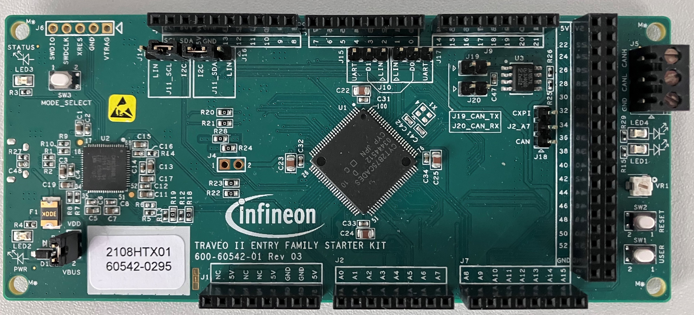

# Code Examples
This page features an expanding collection of categorized code examples tailored to the supported development kit. Each code example, contains a detailed README explaining what code example does and how to run/debug it.

For more information about using the starter kits, peripheral access crates and hardware connections, please refer to the [Usage Guide](../usage-guide/README.md).

# TRAVEO™ II Body Entry Starter Kit ([CYTVII-B-E-1M-SK](https://www.infineon.com/cms/en/product/evaluation-boards/cytvii-b-e-1m-sk/))
This section lists all the examples available for the TRAVEO II Body Entry Starter Kit ([CYTVII-B-E-1M-SK](https://www.infineon.com/cms/en/product/evaluation-boards/cytvii-b-e-1m-sk/))

&nbsp; 

## 1. [gpio-access-t2g-bodyentry-starterkit](https://github.com/Infineon/gpio-access-t2g-bodyentry-starterkit)
This code example demonstrates how to use the [CYT2B7 PAC](https://crates.io/crates/cyt2b7) to control read/write GPIOs using the on-board switch (SW1) and LEDs (LED1, LED4). In addition, it also demonstrates safe and unsafe Rust to access peripheral via the PAC.

--

Return to the [Table of Contents](../README.md).
